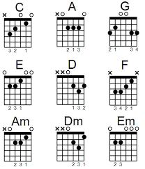
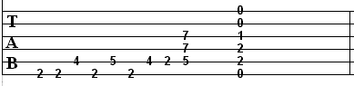

# ChordED

ChordED is a CLI tool written in java that is meant to create and store guitar chords. It is a bit of combination of a guitar  
chord chart and guitar tablature.  
  
Combined with:    
  
Creates this:  
```
	Em  
   -----------------    
O || - - - - - - - ||  
O || - - - - - - - ||    
O || - - - - - - - ||  
- || - O - - - - - ||       
- || - O - - - - - ||  
O || - - - - - - - ||    
   -----------------
```
